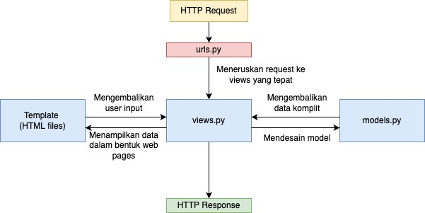

# Katalog App

Link heroku: https://tugas-pbp.herokuapp.com/katalog/

## Bagan Request-Response Django

## Kenapa Harus Virtual Environment

Masing-masing project yang menggunakan Django memiliki dependency yang unik dari project lainnya.
Oleh karena itu dibutuhkan sebuah environment khusus untuk menampung dependency yang unik tersebut.
Jika tidak demikian, potensi munculnya konflik dependency semakin besar.
Virtual environment yang dibawa oleh Python adalah salah satu cara implementasi environment khusus tersebut.
Meskipun demikian, mengembangkan projek django tanpa virtual environment sangat dimungkinkan, namun dengan risikonya sendiri.

## Implementasi views.py

Saya mengimplementasi views.py dengan cara membuat sebuah fungsi show_katalog. 
Fungsi ini menerima sebuah parameter request.
Pada fungsi tersebut, saya mengambil list object dari model CatalogItem yang ada pada database.
Lalu saya membuat variabel baru bernama context yang berisi list object tadi, nama dan NPM saya.
Context ini akan di passing ke fungsi render yang akan menampilkan data-data tersebut menggunakan template katalog.html.

## Implementasi Routing

Saya mengisi file urls.py pada katalog dengan path url kosong yang mengarah ke fungsi show_katalog pada views.py katalog. Lalu file urls in saya include di dalam urls.py utama pada project_django dengan url katalog/. Struktur ini akan mempermudah kita dalam maintain url kedepannya.

## Implementasi pemetaan data Django ke dalam template HTML

Pada file katalog.html di app katalog, saya menambahkan syntax for loop di bawah table header. Loop ini akan menampilkan masing-masing attribute dari object CatalogItem dibawah header yang sesuai dengan menggunakan html tag td dengan css text align center. 

## Implementasi deployment ke Heroku

Saya menuju dashboard heroku untuk membuat app baru. Saya beri judul tugas-pbp. Lalu saya simpan api key dan nama app saya untuk disimpan pada github secret. Setelah itu, saya menjalankan kembali semua workflow yang sebelumnya gagal karena tidak ada secrets yang diperlukan.

## Implementasi testing Django

Saya membuat 2 test untuk memastikan aplikasi saya berjalan sesuai prosedur. Tes yang pertama akan memeriksa url, yaitu apakah bisa diakses dan mereturn kode http OK. Tes yang kedua akan memeriksa template, yaitu apakah view dalam app katalog sudah menggunakan template yang sesuai.