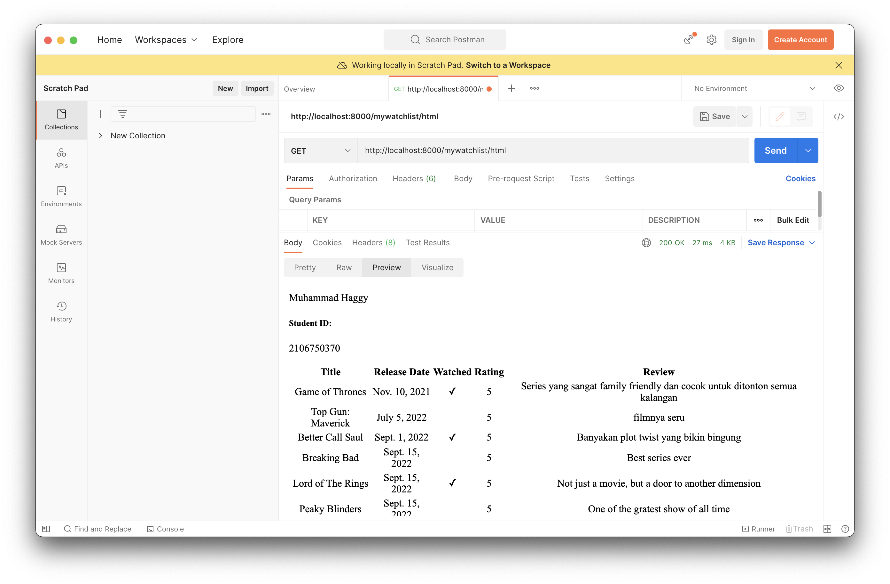
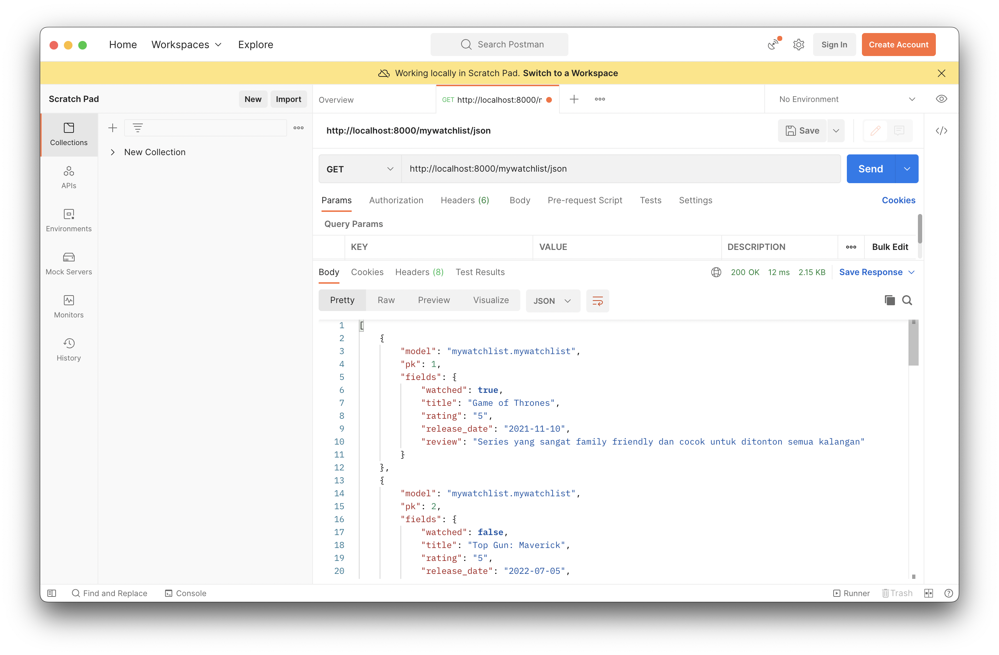
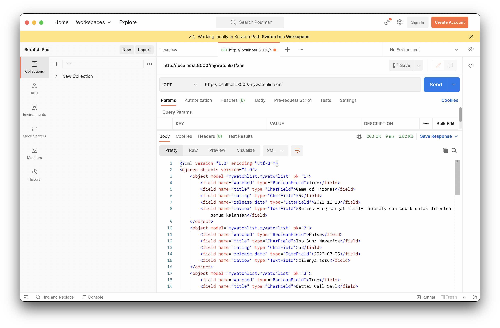

# My Watchlist

## Link Heroku 
https://tugas-pbp.herokuapp.com/mywatchlist/html/

## Perbedaan HTML, JSON, dan XML 
HTML adalah markup langugage yang biasanya berfungsi untuk menampilkan dan menformat data ataupun informasi. Sedangkan XML adalah markup language yang sering digunakan dalam hal penyimpanan data atau pertukaran data antar komputer. HTML bersifat statis, sedangkan XML bersifat dinamis. HTML menerapkan aturan yang lebih longgar daripada XML, dimana beberapa kesalahan masih ditoleransi.

JSON adalah format pertukaran data. Json didesain supaya mudah untuk ditulis dan dibaca oleh manusia, jauh lebih mudah dari XML. Namun, XML relatif lebih aman dari JSON karena aturannya yang lebih ketat. XML punya start tags dan juga end tags, namun JSON tidak memiliki end tags.

## Mengapa Data Delivery diperlukan? 
Data delivery dibutuhkan dalam implementasi sebuah platform yang terdiri dari front-end dan back-end. Tanpa data delivery, data yang sudah disimpan di dalam database back-end tidak akan bisa ditampilkan oleh aplikasi front-end. Selain itu, data yang diinput user pada aplikasi front-end juga tidak akan bisa tersimpan dalam database back-end.

## Implementasi Pembuatan App mywatchlist 
Saya menjalankan perintah python manage.py startapp mywatchlist. Setelah itu, saya tambahkan app baru itu ke dalam installed apps di project folder.

## Implementasi Routing mywatchlist 
Saya menyertakan mywatchlist.urls ke dalam urls.py pada direktori project folder, yaitu pada url 'mywatchlist/'. Lalu saya mulai mengisi urls.py pada app mywatchlist, yang pertama adalah url 'html/' yang mengarah pada fungsi show_html pada view, yang kedua adalah url 'json/' yang mengarah pada fungsi show_json pada view, dan yang terakhir adalah url 'xml/' yang mengarah pada fungsi show_xml.

## Implementasi Model Watchlist
Saya membuat sebuah class model bernama MyWatchList yang berisi atribut:
* watched, sebuah field boolean yang merepresentasikan apakah film ini sudah saya tonton.
* title, sebuah charfield (menampung String pendek) yang merepresentasikan judul film/series.
* rating, sebuah charfield yang dapat menampung string angka dari satu sampai lima yang merepresentasikan rating saya terhadap film/series tersebut.
* release_date, sebuah datefield yang merepresentasikan tanggal rilis dari film/series tersebut.
* review, sebuah textfield (menampung string panjang) yang merepresentasikan pendapat pribadi saya terhadap film/series tersebut.

## Postman Pictures
HTTP request http://localhost:8000/mywatchlist/html

HTTP request http://localhost:8000/mywatchlist/json

HTTP request http://localhost:8000/mywatchlist/xml
